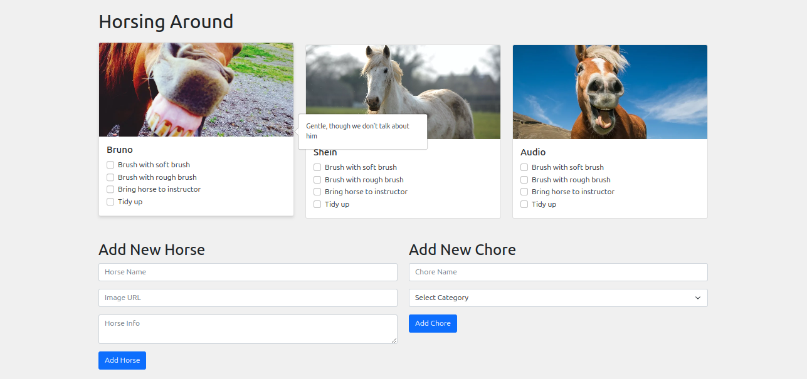
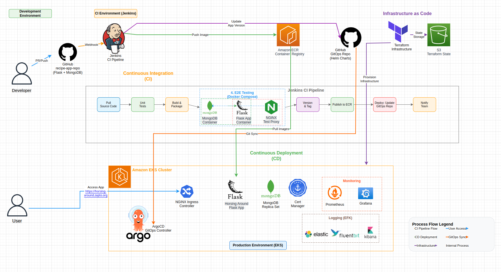

# Horsing Around

A web application for managing horse farm volunteer chores. Built with Flask, MongoDB, and Nginx, fully containerized with Docker Compose, and deployed to EKS via a Jenkins CI/CD pipeline and ArgoCD GitOps.



## Complete Project Flow

**Related repositories:**
- [HA-infrastructure](https://github.com/CarmitHaas/HA-infrastructure) - Terraform EKS cluster
- [gitops-HA](https://github.com/CarmitHaas/gitops-HA) - ArgoCD GitOps manifests



## Features

- Welcome screen with volunteering information
- Separate admin and volunteer access
- Horse grid with pictures and hover info
- Chore tracking with checkboxes (Day Opening, Pre Lesson, Post Lesson, End of Day)
- Admin: add/remove horses and chores, change password
- Automatic checkbox reset at midnight
- Prometheus metrics endpoint (`/metrics`)
- Responsive Bootstrap design

## Quick Start

```bash
git clone https://github.com/CarmitHaas/Horsing-Around.git
cd Horsing-Around
docker compose up --build
```

Access the application at `http://localhost`

## Configuration

| Variable | Default | Description |
|----------|---------|-------------|
| `MONGO_URI` | `mongodb://localhost:27017/` | MongoDB connection string |
| `SECRET_KEY` | random | Flask session secret key |
| `ADMIN_USER` | `admin` | Initial admin username |
| `ADMIN_PASSWORD` | `admin` | Initial admin password |
| `FLASK_DEBUG` | `false` | Enable Flask debug mode |

**Important:** Change the default admin credentials in production by setting `ADMIN_USER` and `ADMIN_PASSWORD` environment variables.

## CI/CD Pipeline

The Jenkins pipeline runs: Unit Tests -> Build -> E2E Tests -> Tag -> Publish to ECR -> Deploy via GitOps

E2E tests run inside the Docker network using service names - no traffic leaves the network.

## Running Tests

```bash
pip install -r requirements.txt pytest
pytest tests/ -v
```

